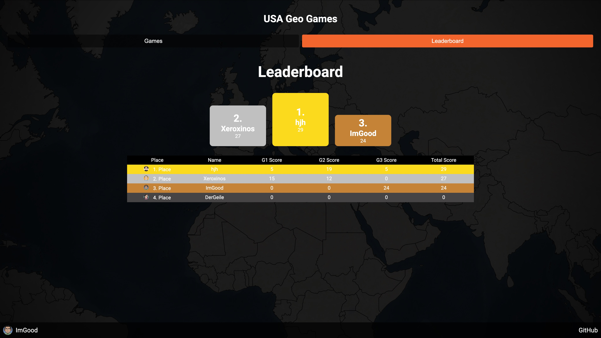
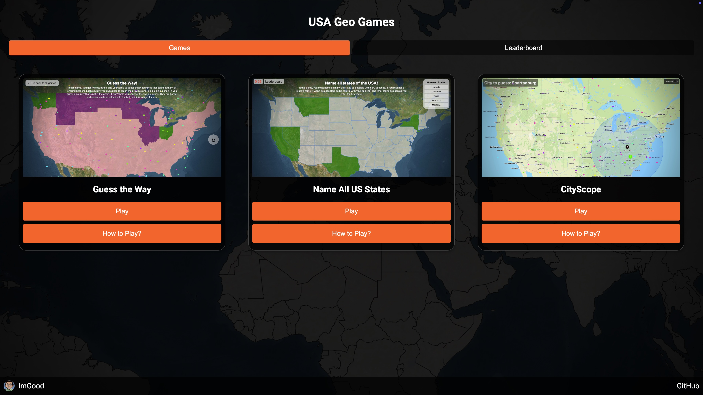
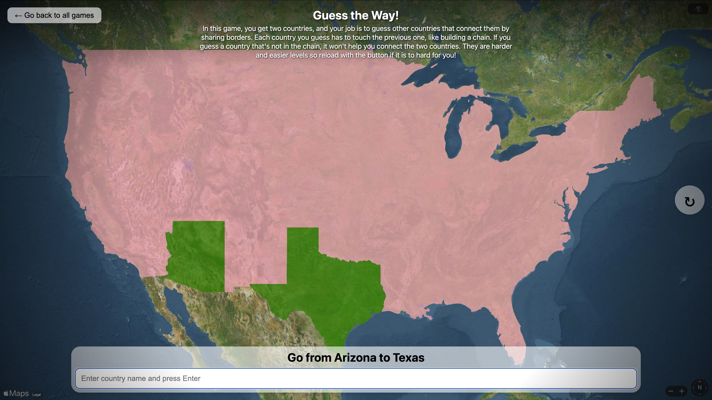
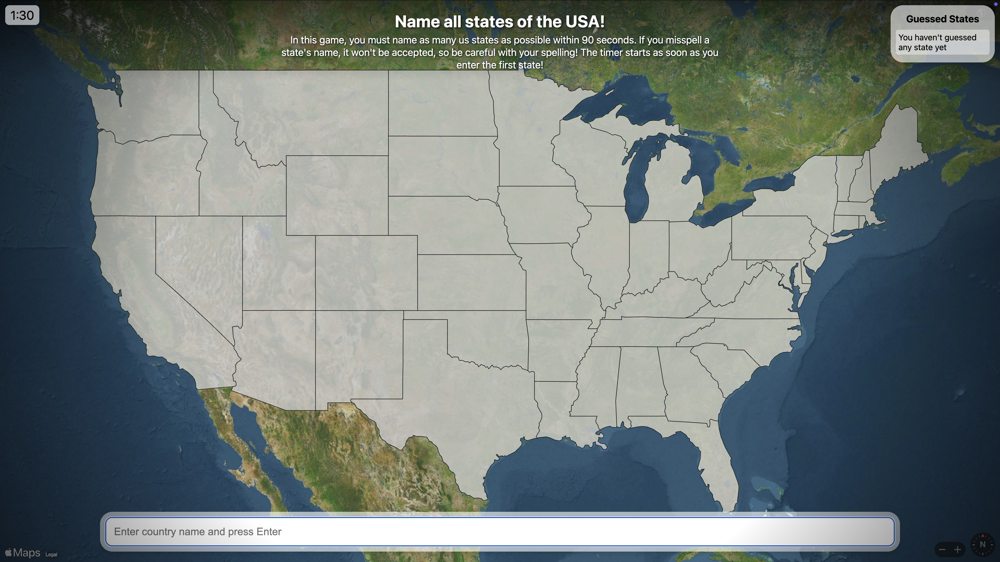
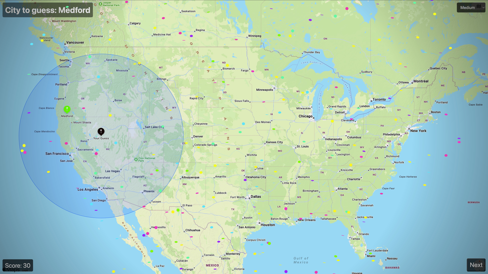

## 🌍 GeoGames USA - Test Your Geography Knowledge About the USA

GeoGames USA is a collection of geography games about the United States. Currently, there are three games available:

1. **Guess the Way** – You are given two US states and must connect them.
2. **Name All US States** – The challenge is to name as many US states as possible within 1:30 minutes.
3. **CityScope** – You are given a city and must find its location using a radius. There are five difficulty levels, ranging from *very easy* to *very hard*.  

   *Disclaimer:* CityScope was originally developed as a separate project. However, since it fits well within GeoGames USA, I decided to include it with slight modifications. Most of my development time was focused on *Guess the Way* and *Name All US States*.

## 🚀 How to Use

1. Open the [GeoGames USA Demo](https://www.control-center.eu/).
2. Choose a **username** and select one of **seven avatars** to personalize your experience.
3. After registering, you will be redirected to the **homepage**, where the three games are listed.
4. Pick a game and first read the instructions by clicking the **"How to play?"** button.
5. Start the game and have fun testing your geography knowledge!
6. After playing, don't forget to check your ranking on the **leaderboard**.

## 🎮 How to Play & Scoring System

Each game has different mechanics and a unique scoring system:

- **Guess the Way** 🛤️  
  You are given two US states and must connect them.  
  **Scoring:** Each successful connection earns **5 points** for the leaderboard.

- **Name All US States** 🗺️  
  You have 1:30 minutes to name as many US states as possible.  
  **Scoring:** Your score equals the number of correctly named states. However, this score is **not cumulative**—if you score higher than your previous best, your leaderboard score updates to the new high score.

- **CityScope** 📍  
  You are given a city name and must locate it using a radius.  
  **Scoring:** Points are awarded based on the difficulty level at which you correctly locate the city. Harder levels give more points.

To fully understand each game, click the **"How to play?"** button before starting.

## 🏆 Leaderboard

On the homepage, there is a second tab with the *Leaderboard* section. The leaderboard is shared across all three games, so the overall best player ranks first.  

In the table:
- **G1 Score** → Score for *Guess the Way*
- **G2 Score** → Score for *Name All US States*
- **G3 Score** → Score for *CityScope*

## 🌐 Demo

Try GeoGames USA live at:  
🔗 [GeoGames USA Demo](https://www.control-center.eu/)

## 📢 Disclaimer
The grammar and spelling in this README.md were improved by ChatGPT.

## Screenshots







## Project setup
```
npm install
```

### Compiles and hot-reloads for development
```
npm run serve
```

### Compiles and minifies for production
```
npm run build
```

### Lints and fixes files
```
npm run lint
```

### Customize configuration
See [Configuration Reference](https://cli.vuejs.org/config/).

# Ideas
- Ability to show countries outline
